```r
# if we used both 'echo=TRUE' and 'results=hide' the pipe would not work properly
# if we used 'echo = FALSE' and 'results=hide' we would have only messages (i.e. attaching package) If we don't want them we set 'error = FALSE', 'warning = FALSE', and 'message = FALSE'.
library(dplyr)
```

```
## 
## Attaching package: 'dplyr'
```

```
## The following objects are masked from 'package:stats':
## 
##     filter, lag
```

```
## The following objects are masked from 'package:base':
## 
##     intersect, setdiff, setequal, union
```

```r
library(ggplot2)
library(gridExtra) # display plots side by side
```

```
## 
## Attaching package: 'gridExtra'
```

```
## The following object is masked from 'package:dplyr':
## 
##     combine
```

## Drawing your first plot


```r
# Load the ggplot2 package
library(ggplot2)

# Explore the mtcars data frame with str()
str(mtcars)
```

```
## 'data.frame':	32 obs. of  11 variables:
##  $ mpg : num  21 21 22.8 21.4 18.7 18.1 14.3 24.4 22.8 19.2 ...
##  $ cyl : num  6 6 4 6 8 6 8 4 4 6 ...
##  $ disp: num  160 160 108 258 360 ...
##  $ hp  : num  110 110 93 110 175 105 245 62 95 123 ...
##  $ drat: num  3.9 3.9 3.85 3.08 3.15 2.76 3.21 3.69 3.92 3.92 ...
##  $ wt  : num  2.62 2.88 2.32 3.21 3.44 ...
##  $ qsec: num  16.5 17 18.6 19.4 17 ...
##  $ vs  : num  0 0 1 1 0 1 0 1 1 1 ...
##  $ am  : num  1 1 1 0 0 0 0 0 0 0 ...
##  $ gear: num  4 4 4 3 3 3 3 4 4 4 ...
##  $ carb: num  4 4 1 1 2 1 4 2 2 4 ...
```

```r
# Execute the following command
ggplot(mtcars, aes(cyl, mpg)) +
  geom_point()
```

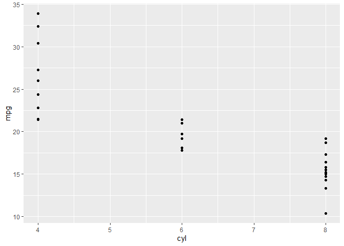<!-- -->

## Data columns types affect plot types


```r
# Change the command below so that cyl is treated as factor
ggplot(mtcars, aes(factor(cyl), mpg)) +
  geom_point()
```

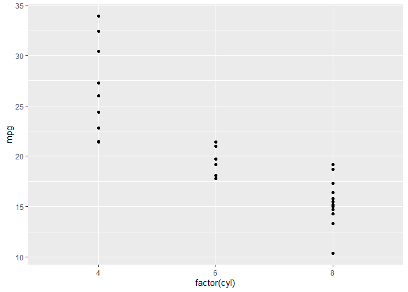<!-- -->

## The grammar of graphics


```r
# Edit to add a color aesthetic mapped to disp
ggplot(mtcars, aes(wt, mpg, color = disp)) +
  geom_point()
```

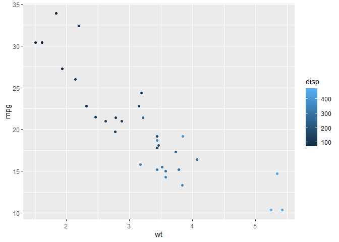<!-- -->

```r
# Change the color aesthetic to a size aesthetic
ggplot(mtcars, aes(wt, mpg, size = disp)) +
  geom_point()
```

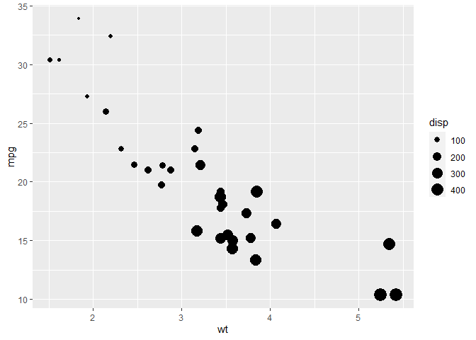<!-- -->

## ggplot2 layers


```r
load('diamonds.RData') # load R workspace

# Add geom_point() with +
ggplot(diamonds, aes(carat, price)) + geom_point()
```

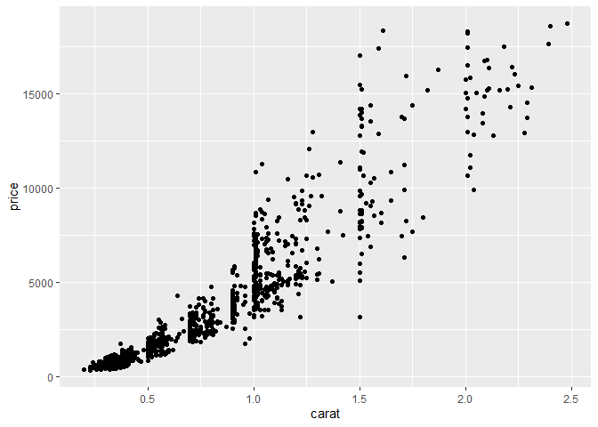<!-- -->

```r
# Add geom_smooth() with +
ggplot(diamonds, aes(carat, price)) +
  geom_point() + geom_smooth()
```

```
## `geom_smooth()` using method = 'gam' and formula 'y ~ s(x, bs = "cs")'
```

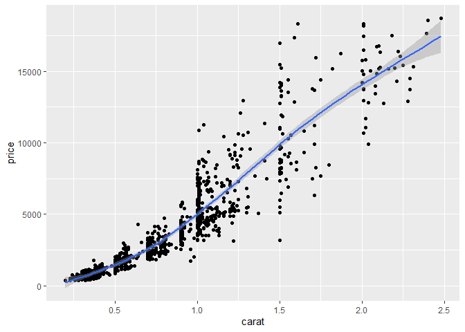<!-- -->

## Changing one geom or every geom


```r
# Map the color aesthetic to clarity
ggplot(diamonds, aes(carat, price, color = clarity)) +
  geom_point() +
  geom_smooth()
```

```
## `geom_smooth()` using method = 'loess' and formula 'y ~ x'
```

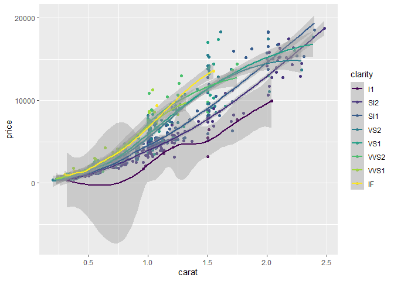<!-- -->

```r
# Make the points 40% opaque
ggplot(diamonds, aes(carat, price, color = clarity)) +
  geom_point(alpha = 0.4) +
  geom_smooth()
```

```
## `geom_smooth()` using method = 'loess' and formula 'y ~ x'
```

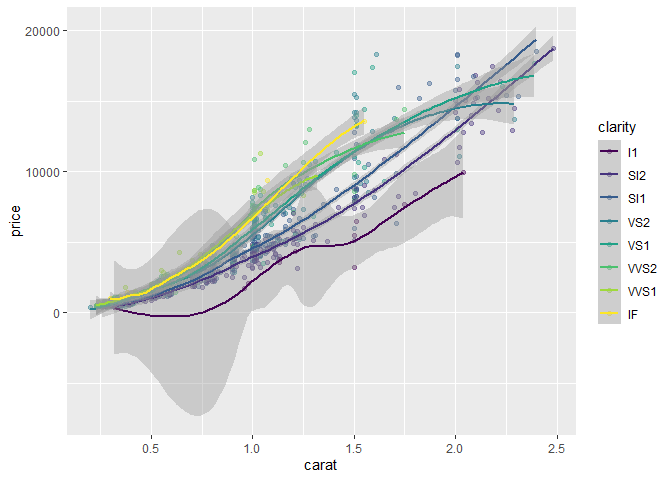<!-- -->

## Saving plots as variables


```r
# Draw a ggplot
plt_price_vs_carat <- ggplot(diamonds, aes(carat, price)) + geom_point()
plt_price_vs_carat
```

<!-- -->

```r
# From previous step
plt_price_vs_carat <- ggplot(diamonds, aes(carat, price))

# Edit this to make points 20% opaque: plt_price_vs_carat_transparent
plt_price_vs_carat_transparent <- plt_price_vs_carat + geom_point(alpha = 0.2)

# See the plot
plt_price_vs_carat_transparent
```

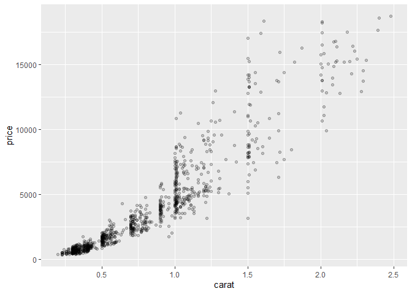<!-- -->

```r
# From previous step
plt_price_vs_carat <- ggplot(diamonds, aes(carat, price))

# Edit this to map color to clarity,
# Assign the updated plot to a new object
plt_price_vs_carat_by_clarity <- plt_price_vs_carat + geom_point(aes(color = clarity))

# See the plot
plt_price_vs_carat_by_clarity
```

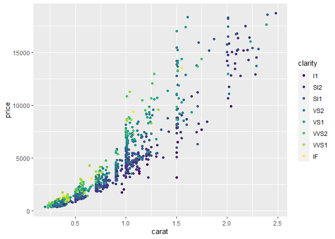<!-- -->

```r
# Which I believe gives the very same plot as the following line of code
tmp <- ggplot(diamonds, aes(carat, price, color = clarity)) + geom_point()

grid.arrange(plt_price_vs_carat_by_clarity, tmp, ncol = 2)
```

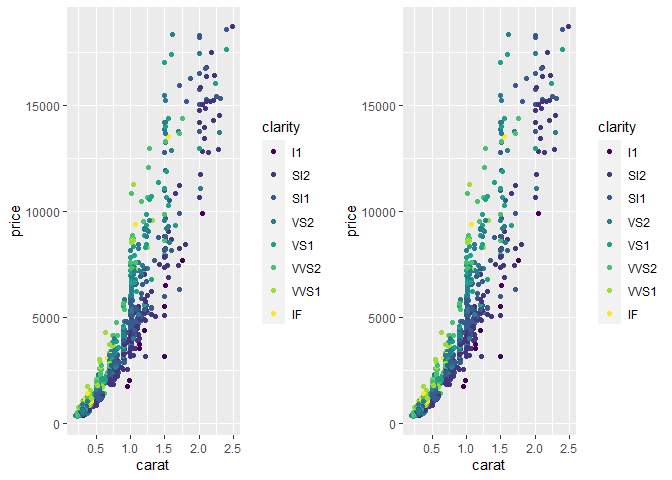<!-- -->

