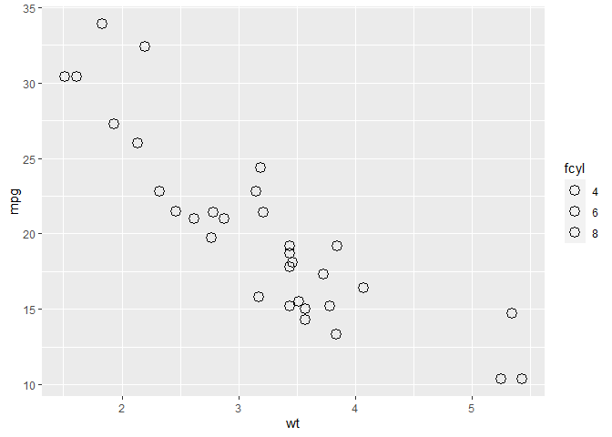
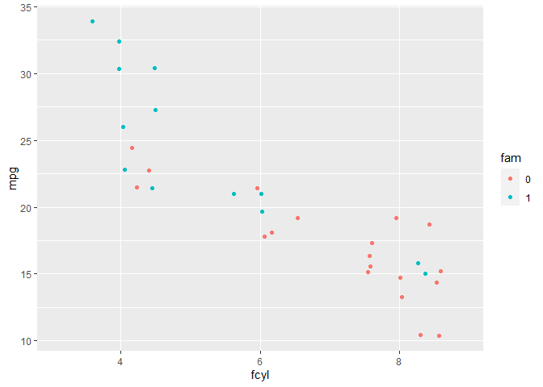
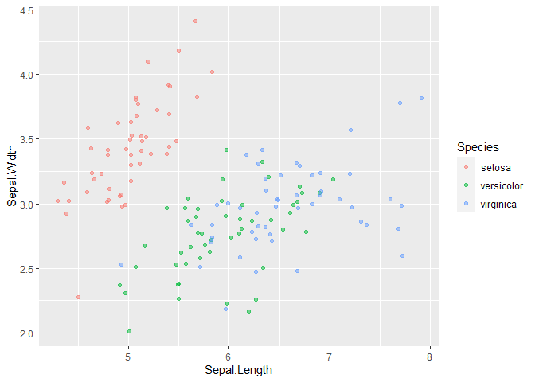
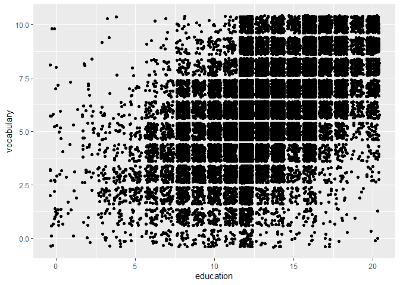
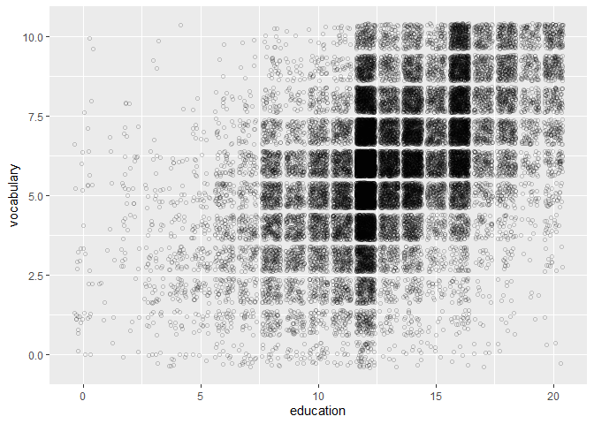

```
## 
## Attaching package: 'dplyr'
```

```
## The following objects are masked from 'package:stats':
## 
##     filter, lag
```

```
## The following objects are masked from 'package:base':
## 
##     intersect, setdiff, setequal, union
```

```
## 
## Attaching package: 'gridExtra'
```

```
## The following object is masked from 'package:dplyr':
## 
##     combine
```

## Drawing your first plot


```r
# Load the ggplot2 package
library(ggplot2)

# Explore the mtcars data frame with str()
str(mtcars)
```

```
## 'data.frame':	32 obs. of  11 variables:
##  $ mpg : num  21 21 22.8 21.4 18.7 18.1 14.3 24.4 22.8 19.2 ...
##  $ cyl : num  6 6 4 6 8 6 8 4 4 6 ...
##  $ disp: num  160 160 108 258 360 ...
##  $ hp  : num  110 110 93 110 175 105 245 62 95 123 ...
##  $ drat: num  3.9 3.9 3.85 3.08 3.15 2.76 3.21 3.69 3.92 3.92 ...
##  $ wt  : num  2.62 2.88 2.32 3.21 3.44 ...
##  $ qsec: num  16.5 17 18.6 19.4 17 ...
##  $ vs  : num  0 0 1 1 0 1 0 1 1 1 ...
##  $ am  : num  1 1 1 0 0 0 0 0 0 0 ...
##  $ gear: num  4 4 4 3 3 3 3 4 4 4 ...
##  $ carb: num  4 4 1 1 2 1 4 2 2 4 ...
```

```r
# Execute the following command
ggplot(mtcars, aes(cyl, mpg)) +
  geom_point()
```

<!-- -->

## Data columns types affect plot types


```r
# Change the command below so that cyl is treated as factor
ggplot(mtcars, aes(factor(cyl), mpg)) +
  geom_point()
```

<!-- -->

## The grammar of graphics


```r
# Edit to add a color aesthetic mapped to disp
ggplot(mtcars, aes(wt, mpg, color = disp)) +
  geom_point()
```

<!-- -->

```r
# Change the color aesthetic to a size aesthetic
ggplot(mtcars, aes(wt, mpg, size = disp)) +
  geom_point()
```

<!-- -->

## ggplot2 layers


```r
load('diamonds.RData') # load R workspace

# Add geom_point() with +
ggplot(diamonds, aes(carat, price)) + geom_point()
```

<!-- -->

```r
# Add geom_smooth() with +
ggplot(diamonds, aes(carat, price)) +
  geom_point() + geom_smooth()
```

```
## `geom_smooth()` using method = 'gam' and formula 'y ~ s(x, bs = "cs")'
```

<!-- -->

## Changing one geom or every geom


```r
# Map the color aesthetic to clarity
ggplot(diamonds, aes(carat, price, color = clarity)) +
  geom_point() +
  geom_smooth()
```

```
## `geom_smooth()` using method = 'loess' and formula 'y ~ x'
```

<!-- -->

```r
# Make the points 40% opaque
ggplot(diamonds, aes(carat, price, color = clarity)) +
  geom_point(alpha = 0.4) +
  geom_smooth()
```

```
## `geom_smooth()` using method = 'loess' and formula 'y ~ x'
```

<!-- -->

## Saving plots as variables


```r
# Draw a ggplot
plt_price_vs_carat <- ggplot(diamonds, aes(carat, price)) + geom_point()
plt_price_vs_carat
```

<!-- -->

```r
# From previous step
plt_price_vs_carat <- ggplot(diamonds, aes(carat, price))

# Edit this to make points 20% opaque: plt_price_vs_carat_transparent
plt_price_vs_carat_transparent <- plt_price_vs_carat + geom_point(alpha = 0.2)

# See the plot
plt_price_vs_carat_transparent
```

<!-- -->

```r
# From previous step
plt_price_vs_carat <- ggplot(diamonds, aes(carat, price))

# Edit this to map color to clarity,
# Assign the updated plot to a new object
plt_price_vs_carat_by_clarity <- plt_price_vs_carat + geom_point(aes(color = clarity))

# See the plot
plt_price_vs_carat_by_clarity
```

<!-- -->

```r
# Which I believe gives the very same plot as the following line of code
tmp <- ggplot(diamonds, aes(carat, price, color = clarity)) + geom_point()

grid.arrange(plt_price_vs_carat_by_clarity, tmp, ncol = 2)
```

<!-- -->

## All about aesthetics: color, shape and size


```r
mtcars$fcyl <- factor(mtcars$cyl) # cyl transformed into a factor

# Map x to mpg and y to fcyl
ggplot(mtcars, aes(mpg, fcyl)) +
  geom_point()
```

<!-- -->

```r
# Swap mpg and fcyl
ggplot(mtcars, aes(fcyl, mpg)) +
  geom_point()
```

<!-- -->

```r
# Map x to wt, y to mpg and color to fcyl
ggplot(mtcars, aes(wt, mpg, color = fcyl)) +
  geom_point()
```

<!-- -->

```r
ggplot(mtcars, aes(wt, mpg, color = fcyl)) +
  # Set the shape and size of the points
  geom_point(shape = 1, size = 4)
```

<!-- -->

## All about aesthetics: color vs. fill


```r
mtcars$fam <- factor(mtcars$am) # am transformed into a factor

# Map fcyl to fill
ggplot(mtcars, aes(wt, mpg, fill = fcyl)) +
  geom_point(shape = 1, size = 4)
```

<!-- -->

```r
ggplot(mtcars, aes(wt, mpg, fill = fcyl)) +
  # Change point shape; set alpha
  geom_point(shape = 21, size = 4, alpha = 0.6)
```

<!-- -->

```r
# Map color to fam
ggplot(mtcars, aes(wt, mpg, fill = fcyl, color = fam)) +
  geom_point(shape = 21, size = 4, alpha = 0.6)
```

<!-- -->

Shapely coding! Notice that mapping a categorical variable onto fill doesn't change the colors, although a legend is generated! This is because the default shape for points only has a color attribute and not a fill attribute! Use fill when you have another shape (such as a bar), or when using a point that does have a fill and a color attribute, such as `shape = 21`, which is a circle with an outline. Any time you use a solid color, make sure to use alpha blending to account for over plotting.

## All about aesthetics: comparing aesthetics


```r
# Establish the base layer
plt_mpg_vs_wt <- ggplot(mtcars, aes(wt, mpg))

# Map fcyl to size
plt_mpg_vs_wt + geom_point(aes(size = fcyl))
```

```
## Warning: Using size for a discrete variable is not advised.
```

<!-- -->

```r
# Map fcyl to alpha, not size
plt_mpg_vs_wt +
  geom_point(aes(alpha = fcyl))
```

```
## Warning: Using alpha for a discrete variable is not advised.
```

<!-- -->

```r
# Map fcyl to shape, not alpha
plt_mpg_vs_wt +
  geom_point(aes(shape = fcyl))
```

<!-- -->

```r
# Use text layer and map fcyl to label
plt_mpg_vs_wt +
  geom_text(aes(label = fcyl))
```

<!-- -->

Note: `label` and `shape` are only applicable to categorical data.

## Using attributes

## All about attributes: color, shape, size and alpha


```r
# A hexadecimal color
my_blue <- "#4ABEFF"

ggplot(mtcars, aes(wt, mpg)) +
  # Set the point color and alpha
  geom_point(color = my_blue, alpha = 0.6)
```

<!-- -->

```r
# Change the color mapping to a fill mapping
ggplot(mtcars, aes(wt, mpg, fill = fcyl)) +
  # Set point size and shape
  geom_point(color = my_blue, size = 10, shape = 1)
```

<!-- -->

## All about attributes: conflicts with aesthetics


```r
ggplot(mtcars, aes(wt, mpg, color = fcyl)) +
  # Add point layer with alpha 0.5
  geom_point(alpha = 0.5)
```

<!-- -->

```r
ggplot(mtcars, aes(wt, mpg, color = fcyl)) +
  # Add text layer with label rownames(mtcars) and color red
  geom_text(label = row.names(mtcars), color = 'red')
```

<!-- -->

```r
ggplot(mtcars, aes(wt, mpg, color = fcyl)) +
  # Add points layer with shape 24 and color yellow
geom_point(shape = 24, color = "yellow")
```

<!-- -->

## Going all out

Notice that adding more aesthetic mappings to your plot is not always a good idea! You may just increase complexity and decrease readability.


```r
# 3 aesthetics: qsec vs. mpg, colored by fcyl
ggplot(mtcars, aes(mpg, qsec, color = fcyl)) +
  geom_point()
```

<!-- -->

```r
# 4 aesthetics: add a mapping of shape to fam
ggplot(mtcars, aes(mpg, qsec, color = fcyl, shape = fam)) +
  geom_point()
```

<!-- -->

```r
# 5 aesthetics: add a mapping of size to hp / wt
ggplot(mtcars, aes(mpg, qsec, color = fcyl, shape = fam, size = hp/wt)) +
  geom_point()
```

<!-- -->

That's a pretty slick plot! Between the x and y dimensions, the color, shape, and size of the points, your plot displays five dimensions of the dataset!

## Modifying aesthetics

## Updating aesthetic labels


```r
ggplot(mtcars, aes(fcyl, fill = fam)) +
  geom_bar() +
  # Set the axis labels
  labs(x = "Number of Cylinders",
  y = "Count")
```

<!-- -->

```r
palette <- c(automatic = "#377EB8", manual = "#E41A1C")

ggplot(mtcars, aes(fcyl, fill = fam)) +
  geom_bar() +
  labs(x = "Number of Cylinders", y = "Count") +
  # Set the fill color scale
  scale_fill_manual("Transmission", values = palette)
```

<!-- -->

```r
palette <- c(automatic = "#377EB8", manual = "#E41A1C")

# Set the position
ggplot(mtcars, aes(fcyl, fill = fam)) +
  geom_bar(position = 'dodge') +
  labs(x = "Number of Cylinders", y = "Count")
```

<!-- -->

```r
  scale_fill_manual("Transmission", values = palette)
```

```
## <ggproto object: Class ScaleDiscrete, Scale, gg>
##     aesthetics: fill
##     axis_order: function
##     break_info: function
##     break_positions: function
##     breaks: waiver
##     call: call
##     clone: function
##     dimension: function
##     drop: TRUE
##     expand: waiver
##     get_breaks: function
##     get_breaks_minor: function
##     get_labels: function
##     get_limits: function
##     guide: legend
##     is_discrete: function
##     is_empty: function
##     labels: waiver
##     limits: NULL
##     make_sec_title: function
##     make_title: function
##     map: function
##     map_df: function
##     n.breaks.cache: NULL
##     na.translate: TRUE
##     na.value: NA
##     name: Transmission
##     palette: function
##     palette.cache: NULL
##     position: left
##     range: <ggproto object: Class RangeDiscrete, Range, gg>
##         range: NULL
##         reset: function
##         train: function
##         super:  <ggproto object: Class RangeDiscrete, Range, gg>
##     rescale: function
##     reset: function
##     scale_name: manual
##     train: function
##     train_df: function
##     transform: function
##     transform_df: function
##     super:  <ggproto object: Class ScaleDiscrete, Scale, gg>
```

## Setting a dummy aesthetic

We need it when we want univariate plots.

```r
# Plot 0 vs. mpg
ggplot(mtcars, aes(mpg, 0)) +
  # Add jitter 
  geom_point(position = "jitter")
```

<!-- -->

```r
ggplot(mtcars, aes(mpg, 0)) +
  geom_jitter() +
  # Set the y-axis limits
  ylim(c(-2, 2))
```

<!-- -->

## Scatter plots

## Overplotting 1: large datasets


```r
load("diamonds.RData")

# Plot price vs. carat, colored by clarity
plt_price_vs_carat_by_clarity <- ggplot(diamonds, aes(carat, price, color = clarity))

# Add a point layer with tiny points
plt_price_vs_carat_by_clarity + geom_point(alpha = 0.5, shape = ".")
```

<!-- -->

```r
# Update the point shape to remove the line outlines by setting shape to 16
plt_price_vs_carat_by_clarity + geom_point(alpha = 0.5, shape = 16)
```

<!-- -->

## Overplotting 2: Aligned values


```r
# Plot base
plt_mpg_vs_fcyl_by_fam <- ggplot(mtcars, aes(fcyl, mpg, color = fam))

# Default points are shown for comparison
plt_mpg_vs_fcyl_by_fam + geom_point()
```

<!-- -->

```r
# Alter the point positions by jittering, width 0.3
plt_mpg_vs_fcyl_by_fam + geom_point(position = position_jitter(width = 0.3))
```

<!-- -->

```r
# Now jitter and dodge the point positions
plt_mpg_vs_fcyl_by_fam + geom_point(position = position_jitterdodge(jitter.width = 0.3, dodge.width = 0.3))
```

<!-- -->

## Overplotting 3: Low-precision data


```r
ggplot(iris, aes(Sepal.Length, Sepal.Width, color = Species)) +
  # Swap for jitter layer with width 0.1
  geom_jitter(alpha = 0.5, width = 0.1)
```

<!-- -->

Now we use a different approach:

Within `geom_point()`, set `position` to `"jitter"`.


```r
ggplot(iris, aes(Sepal.Length, Sepal.Width, color = Species)) +
  # Set the position to jitter
  geom_point(position = "jitter", alpha = 0.5)
```

<!-- -->

Provide an alternative specification:

Have the `position` argument call `position_jitter()` with a `width` of `0.1`.


```r
ggplot(iris, aes(Sepal.Length, Sepal.Width, color = Species)) +
  # Use a jitter position function with width 0.1
  geom_point(alpha = 0.5, position = position_jitter(width = 0.1))
```

<!-- -->

## Overplotting 4: Integer data


```r
library(car) # to load Vocab data set
```

```
## Loading required package: carData
```

```
## 
## Attaching package: 'car'
```

```
## The following object is masked from 'package:dplyr':
## 
##     recode
```

```r
# Examine the structure of Vocab
str(Vocab)
```

```
## 'data.frame':	30351 obs. of  4 variables:
##  $ year      : num  1974 1974 1974 1974 1974 ...
##  $ sex       : Factor w/ 2 levels "Female","Male": 2 2 1 1 1 2 2 2 1 1 ...
##  $ education : num  14 16 10 10 12 16 17 10 12 11 ...
##  $ vocabulary: num  9 9 9 5 8 8 9 5 3 5 ...
##  - attr(*, "na.action")= 'omit' Named int [1:32115] 1 2 3 4 5 6 7 8 9 10 ...
##   ..- attr(*, "names")= chr [1:32115] "19720001" "19720002" "19720003" "19720004" ...
```

```r
# Plot vocabulary vs. education
ggplot(Vocab, aes(x = education, y = vocabulary)) +
  # Add a point layer
 geom_point()
```

<!-- -->

```r
ggplot(Vocab, aes(education, vocabulary)) +
  # Change to a jitter layer
  geom_jitter()
```

<!-- -->

```r
ggplot(Vocab, aes(education, vocabulary)) +
  # Set the transparency to 0.2
  geom_jitter(alpha = 0.2)
```

<!-- -->

```r
ggplot(Vocab, aes(education, vocabulary)) +
  # Set the shape to 1
  geom_jitter(alpha = 0.2, shape = 1)
```

<!-- -->

## Histograms


```r
# Plot mpg
ggplot(mtcars, aes(mpg)) +
  # Add a histogram layer
  geom_histogram()
```

```
## `stat_bin()` using `bins = 30`. Pick better value with `binwidth`.
```

<!-- -->

```r
ggplot(mtcars, aes(mpg)) +
  # Set the binwidth to 1
  geom_histogram(binwidth = 1)
```

<!-- -->

```r
# Map y to ..density..
ggplot(mtcars, aes(mpg, y = ..density..)) +
  geom_histogram(binwidth = 1)
```

<!-- -->

```r
datacamp_light_blue <- "#51A8C9"

ggplot(mtcars, aes(mpg, ..density..)) +
  # Set the fill color to datacamp_light_blue
  geom_histogram(binwidth = 1, fill = datacamp_light_blue)
```

<!-- -->

## Positions in histograms

Here, we'll examine the various ways of applying positions to histograms. geom_histogram(), a special case of geom_bar(), has a position argument that can take on the following values:

`stack` (the default): Bars for different groups are stacked on top of each other.

`dodge`: Bars for different groups are placed side by side.

`fill`: Bars for different groups are shown as proportions.

`identity`: Plot the values as they appear in the dataset.


```r
# Update the aesthetics so the fill color is by fam
ggplot(mtcars, aes(mpg, fill = fam)) +
  geom_histogram(binwidth = 1)
```

<!-- -->

```r
ggplot(mtcars, aes(mpg, fill = fam)) +
  # Change the position to dodge
  geom_histogram(binwidth = 1, position = "dodge")
```

<!-- -->

```r
ggplot(mtcars, aes(mpg, fill = fam)) +
  # Change the position to fill
  geom_histogram(binwidth = 1, position = "fill")
```

```
## Warning: Removed 16 rows containing missing values (geom_bar).
```

<!-- -->

```r
ggplot(mtcars, aes(mpg, fill = fam)) +
  # Change the position to identity, with transparency 0.4
  geom_histogram(binwidth = 1, position = "identity", alpha = 0.4)
```

<!-- -->

## Bar plots

## Position in bar and col plots


```r
# Plot fcyl, filled by fam
 ggplot(mtcars, aes(fcyl, fill = fam)) +
  # Add a bar layer
  geom_bar()
```

<!-- -->

```r
ggplot(mtcars, aes(fcyl, fill = fam)) +
  # Set the position to "fill"
  geom_bar(position = "fill")
```

<!-- -->

```r
ggplot(mtcars, aes(fcyl, fill = fam)) +
  # Change the position to "dodge"
  geom_bar(position = "dodge")
```

<!-- -->

## Overlapping bar plots


```r
ggplot(mtcars, aes(cyl, fill = fam)) +
  # Change position to use the functional form, with width 0.2
  geom_bar(position = position_dodge(width = 0.2))
```

<!-- -->

```r
ggplot(mtcars, aes(cyl, fill = fam)) +
  # Set the transparency to 0.6
  geom_bar(position = position_dodge(width = 0.2), alpha = 0.6)
```

<!-- -->

## Bar plots: sequential color palette


```r
# Plot education, filled by vocabulary
ggplot(Vocab, aes(education, fill = vocabulary)) +
  # Add a bar layer with position "fill"
geom_bar(position = "fill")
```

<!-- -->

```r
# Plot education, filled by vocabulary
ggplot(Vocab, aes(education, fill = vocabulary)) +
  # Add a bar layer with position "fill"
  geom_bar(position = "fill") +
  # Add a brewer fill scale with default palette
  scale_fill_brewer(palette =  "Set1")
```

<!-- -->

## Line plots

## Multiple time series


```r
load("fish.RData")
str(fish.species)
```

```
## 'data.frame':	61 obs. of  8 variables:
##  $ Year    : int  1950 1951 1952 1953 1954 1955 1956 1957 1958 1959 ...
##  $ Pink    : int  100600 259000 132600 235900 123400 244400 203400 270119 200798 200085 ...
##  $ Chum    : int  139300 155900 113800 99800 148700 143700 158480 125377 132407 113114 ...
##  $ Sockeye : int  64100 51200 58200 66100 83800 72000 84800 69676 100520 62472 ...
##  $ Coho    : int  30500 40900 33600 32400 38300 45100 40000 39900 39200 32865 ...
##  $ Rainbow : int  0 100 100 100 100 100 100 100 100 100 ...
##  $ Chinook : int  23200 25500 24900 25300 24500 27700 25300 21200 20900 20335 ...
##  $ Atlantic: int  10800 9701 9800 8800 9600 7800 8100 9000 8801 8700 ...
```

```r
str(fish.tidy)
```

```
## 'data.frame':	427 obs. of  3 variables:
##  $ Species: Factor w/ 7 levels "Pink","Chum",..: 1 1 1 1 1 1 1 1 1 1 ...
##  $ Year   : int  1950 1951 1952 1953 1954 1955 1956 1957 1958 1959 ...
##  $ Capture: int  100600 259000 132600 235900 123400 244400 203400 270119 200798 200085 ...
```

```r
# Plot the Rainbow Salmon time series
ggplot(fish.species, aes(x = Year, y = Rainbow)) +
  geom_line()
```

<!-- -->

```r
# Plot the Pink Salmon time series
ggplot(fish.species, aes(x = Year, y = Pink)) +
  geom_line()
```

<!-- -->

```r
# Plot multiple time-series by grouping by species
ggplot(fish.tidy, aes(Year, Capture)) +
  geom_line(aes(group = Species))
```

<!-- -->

```r
# Plot multiple time-series by coloring by species
ggplot(fish.tidy, aes(x = Year, y = Capture, color = Species)) +
  geom_line()
```

<!-- -->

## The themes layer


```r
plt_capture_over_t <- ggplot(fish.tidy, aes(x = Year, y = Capture, color = Species)) + geom_line()

plt_capture_over_t + 
  # Remove legend entirely
  theme(legend.position = "none")
```

<!-- -->

```r
plt_capture_over_t + 
  # Position the legend at the bottom of the plot
  theme(legend.position = "bottom")
```

<!-- -->

```r
plt_capture_over_t + 
  # Position the legend inside the plot at (0.6, 0.1)
  theme(legend.position = c(x = 0.6, y = 0.1))
```

<!-- -->

## Modifying theme elements

useful link: https://ggplot2.tidyverse.org/reference/theme.html

- Give all rectangles in the plot, (the rect element) a `fill` color of `"grey92"` (very pale grey).
- Remove the `legend.key`'s outline by setting its `color` to be missing.
Look at the changes in the plot.


```r
# Default plot
plt_capture_over_t
```

<!-- -->

```r
plt_capture_over_t +
  theme(
    # For all rectangles, set the fill color to grey92
    rect = element_rect(fill = "grey92"),
    # For the legend key, turn off the outline
    legend.key = element_rect(color = NA)
  )
```

<!-- -->

- Remove the axis ticks, `axis.ticks` by making them a blank element.

- Remove the panel gridlines, `panel.grid` in the same way.
- Look at the changes in the plot.


```r
plt_capture_over_t +
  theme(
    rect = element_rect(fill = "grey92"),
    legend.key = element_rect(color = NA),
    # Turn off axis ticks
    axis.ticks = element_blank(),
    # Turn off the panel grid
    panel.grid = element_blank()
  )
```

<!-- -->

- Add the major horizontal grid lines back to the plot using `panel.grid.major.y`.

- Set the line `color` to `"white"`, `size` to `0.5`, and `linetype` to `"dotted"`.

- Look at the changes in the plot.


```r
plt_capture_over_t +
  theme(
    rect = element_rect(fill = "grey92"),
    legend.key = element_rect(color = NA),
    axis.ticks = element_blank(),
    panel.grid = element_blank(),
    # Add major y-axis panel grid lines back
      panel.grid.major.y = element_line(
      # Set the color to white
      color = "white",
      # Set the size to 0.5
      size = 0.5,
      # Set the line type to dotted
      linetype = "dotted"
    )
  )
```

<!-- -->

- Make the axis tick labels' text, `axis.text`, less prominent by changing the `color` to `"grey25"`.

- Increase the `plot.title`'s, `size` to `16` and change its font `face` to `"italic"`.

- Look at the changes in the plot.


```r
plt_capture_over_t +
  theme(
    rect = element_rect(fill = "grey92"),
    legend.key = element_rect(color = NA),
    axis.ticks = element_blank(),
    panel.grid = element_blank(),
    panel.grid.major.y = element_line(
      color = "white",
      size = 0.5,
      linetype = "dotted"
    ),
    # Set the axis text color to grey25
    axis.text = element_text(color = "grey25"),
    # Set the plot title font face to italic and font size to 16
    plot.title = element_text(face = "italic", size = 16)
  )
```

<!-- -->

## Modifying whitespace

**Whitespace**: all the non-visible margins and spacing in the plot.


```r
# make a plot
plt_mpg_vs_wt_by_cyl <- ggplot(mtcars, aes(x = wt, y = mpg, color = fcyl)) + 
  geom_point() + 
  labs(
    x = "Weight (1000 lbs)",
    y = "Miles per gallon",
    colour = "factor(cyl)"
    )
```

- Give the axis tick length, `axis.ticks.length`, a unit of `2` `"lines"`.


```r
# View the original plot
plt_mpg_vs_wt_by_cyl
```

<!-- -->

```r
plt_mpg_vs_wt_by_cyl +
  theme(
    # Set the axis tick length to 2 lines
    axis.ticks.length = unit(2, "lines")
  )
```

<!-- -->

- Give the legend key size, `legend.key.size`, a unit of `3` centimeters (`"cm"`).


```r
plt_mpg_vs_wt_by_cyl +
  theme(
    # Set the legend key size to 3 centimeters
    legend.key.size = unit(3, "cm")
  )
```

<!-- -->

- Set the `legend.margin` to `20` points (`"pt"`) on the top, `30` pts on the griht, `40` pts on the bottom, and `50` pts on the left.


```r
plt_mpg_vs_wt_by_cyl +
  theme(
    # Set the legend margin to (20, 30, 40, 50) points
    legend.margin = margin(20, 30, 40, 50, "pt")
  )
```

<!-- -->

- Set the plot margin, plot.margin, to 10, 30, 50, and 70 millimeters ("mm").


```r
plt_mpg_vs_wt_by_cyl +
  theme(
    # Set the plot margin to (10, 30, 50, 70) millimeters
    plot.margin = margin(10, 30, 50, 70, "mm")
  )
```

<!-- -->

## Theme flexibility

## Built-in themes


```r
# Add a black and white theme
plt_capture_over_t +
  theme_bw()
```

<!-- -->

```r
# Add a classic theme
plt_capture_over_t +
  theme_classic()
```

<!-- -->

```r
# Add a void theme
plt_capture_over_t +
  theme_void()
```

<!-- -->

## Exploring ggthemes


```r
library(ggthemes)
```


```r
# Use the fivethirtyeight theme
plt_capture_over_t +
  theme_fivethirtyeight()
```

<!-- -->

```r
# Use Tufte's theme
plt_capture_over_t +
  theme_tufte()
```

<!-- -->

```r
# Use the Wall Street Journal theme
plt_capture_over_t +
  theme_wsj()
```

<!-- -->

## Setting themes


```r
# Save the theme as theme_recession
theme_recession <- theme(
  rect = element_rect(fill = "grey92"),
  legend.key = element_rect(color = NA),
  axis.ticks = element_blank(),
  panel.grid = element_blank(),
  panel.grid.major.y = element_line(color = "white", size = 0.5, linetype = "dotted"),
  axis.text = element_text(color = "grey25"),
  plot.title = element_text(face = "italic", size = 16),
  legend.position = c(0.6, 0.1)
)

# Combine the Tufte theme with theme_recession
# Note that "theme_recession" and "theme_tufte_recession" are NOT functions; we don't need parentheses to use them
theme_tufte_recession <- theme_tufte() + theme_recession

# Add the Tufte recession theme to the plot
plt_capture_over_t + theme_tufte_recession
```

<!-- -->

```r
theme_recession <- theme(
  rect = element_rect(fill = "grey92"),
  legend.key = element_rect(color = NA),
  axis.ticks = element_blank(),
  panel.grid = element_blank(),
  panel.grid.major.y = element_line(color = "white", size = 0.5, linetype = "dotted"),
  axis.text = element_text(color = "grey25"),
  plot.title = element_text(face = "italic", size = 16),
  legend.position = c(0.6, 0.1)
)
theme_tufte_recession <- theme_tufte() + theme_recession

# Set theme_tufte_recession as the default theme
theme_set(theme_tufte_recession)

# Draw the plot (without explicitly adding a theme)
plt_capture_over_t
```

<!-- -->

## Publication-quality plots


```r
plt_capture_over_t +
  # Add Tufte's theme
  theme_tufte()
```

<!-- -->

```r
plt_capture_over_t +
  theme_tufte() +
  # Add individual theme elements
  theme(
    # Turn off the legend
    legend.position = "none",
    # Turn off the axis ticks
    axis.ticks = element_blank()
  )
```

<!-- -->

```r
plt_capture_over_t +
  theme_tufte() +
  theme(
    legend.position = "none",
    axis.ticks = element_blank(),
    # Set the axis title's text color to grey60
    axis.title = element_text(color = "grey60"),
    # Set the axis text's text color to grey60
    axis.text = element_text(color = "grey60")
  )
```

<!-- -->

```r
plt_capture_over_t +
  theme_tufte() +
  theme(
    legend.position = "none",
    axis.ticks = element_blank(),
    axis.title = element_text(color = "grey60"),
    axis.text = element_text(color = "grey60"),
    # Set the panel gridlines major y values
    panel.grid.major.y = element_line(
      # Set the color to grey60
      color = "grey60",
      # Set the size to 0.25
      size = 0.25,
      # Set the linetype to dotted
      linetype = "dotted"
    )
  )
```

<!-- -->

## Effective explanatory plots

## Using geoms for explanatory plots


```r
gm2007<-gapminder %>% filter(year == "2007")
```

- `geom_segment()` adds line segments and requires two additional aesthetics: `xend` and `yend`. To draw a horizontal line for each point, map `30` onto `xend` and `country` onto `yend`.


```r
# Add a geom_segment() layer
ggplot(gm2007, aes(x = lifeExp, y = country, color = lifeExp)) +
  geom_point(size = 4) +
  geom_segment(aes(xend = 30, yend = country), size = 2)
```

<!-- -->

- `geom_text` also needs an additional aesthetic: `label`. Map `lifeExp` onto `label`, and set the attributes `color` to `"white"` and `size` to `1.5`.


```r
# Add a geom_text() layer
ggplot(gm2007, aes(x = lifeExp, y = country, color = lifeExp)) +
  geom_point(size = 4) +
  geom_segment(aes(xend = 30, yend = country), size = 2) +
  geom_text(aes(label = lifeExp), color = "white", size = 1.5)
```

<!-- -->


The color scale has been set for you, but you need to clean up the scales. For the x scale:

- Set `expand` to `c(0, 0)` and `limits` to `c(30, 90)`.
- Place the axis on the top of the plot with the `position` argument.


```r
library(RColorBrewer)
# Set the color scale (need RColorBrewer package)
palette <- brewer.pal(5, "RdYlBu")[-(2:4)]

# Modify the scales
ggplot(gm2007, aes(x = lifeExp, y = country, color = lifeExp)) +
  geom_point(size = 4) +
  geom_segment(aes(xend = 30, yend = country), size = 2) +
  geom_text(aes(label = round(lifeExp,1)), color = "white", size = 1.5) +
  scale_x_continuous("", expand = c(0, 0), limits = c(30, 90), position = "top") +
  scale_color_gradientn(colors = palette)
```

<!-- -->

Make sure to label the plot appropriately using `labs()`:

- Make the title `"Highest and lowest life expectancies, 2007"`.
- Add a reference by setting `caption` to `"Source: gapminder"`.


```r
# Set the color scale
palette <- brewer.pal(5, "RdYlBu")[-(2:4)]

# base plot
plt_country_vs_lifeExp<-ggplot(gm2007, aes(x = lifeExp, y = country, color = lifeExp)) +
  geom_point(size = 4)

# Add a title and caption
plt_country_vs_lifeExp +
  geom_segment(aes(xend = 30, yend = country), size = 2) +
  geom_text(aes(label = round(lifeExp,1)), color = "white", size = 1.5) +
  scale_x_continuous("", expand = c(0,0), limits = c(30,90), position = "top") +
  scale_color_gradientn(colors = palette) +
  labs(title = "Highest and lowest life expectancies, 2007", caption = "Source: gapminder")
```

<!-- -->

## Using annotate() for embellishments

The following values have been calculated for you to assist with adding embellishments to the plot:


```r
global_mean <- mean(gm2007$lifeExp)
x_start <- global_mean + 4
y_start <- 5.5
x_end <- global_mean
y_end <- 7.5
```


Clean up the theme:

- Add a classic theme to the plot with theme_classic().
- Set axis.line.y, axis.ticks.y, and axis.title to element_blank().
- Set the axis.text color to "black".
- Remove the legend by setting legend.position to "none".


```r
# Define the theme
plt_country_vs_lifeExp +
  theme_classic() +
  theme(axis.line.y = element_blank(),
        axis.ticks.y = element_blank(),
        axis.text = element_text(color = "black"),
        axis.title = element_blank(),
        legend.position = "none")
```

<!-- -->

Use geom_vline() to add a vertical line. Set xintercept to global_mean, specify the color to be "grey40", and set linetype to 3.


```r
# theme from previous step
step_1_themes<-theme_classic() +
  theme(axis.line.y = element_blank(),
        axis.ticks.y = element_blank(),
        axis.text = element_text(color = "black"),
        axis.title = element_blank(),
        legend.position = "none")

# Add a vertical line
plt_country_vs_lifeExp +
  step_1_themes +
  geom_vline(xintercept = global_mean, color = "grey40", linetype = 3)
```

<!-- -->

x_start and y_start will be used as positions to place text and have been calculated for you.

- Add a "text" geom as an annotation.
- For the annotation, set x to x_start, y to y_start, and label to `"The\nglobal\naverage"`.


```r
# Add text
plt_country_vs_lifeExp +
  step_1_themes +
  geom_vline(xintercept = global_mean, color = "grey40", linetype = 3) +
  annotate(
    geom = "text",
      x = x_start, 
      y = y_start,
      label = "The\nglobal\naverage",
      vjust = 1, 
      size = 3, 
      color = "grey40"
  )
```

<!-- -->

Annotate the plot with an arrow connecting your text to the line.

- Use a "curve" geom.
- Set the arrow ends xend to x_end and yend to y_end.
- Set the length of the arrowhead to 0.2 cm and the type to "closed".


```r
step_3_annotation<-annotate(
    geom = "text",
      x = x_start, 
      y = y_start,
      label = "The\nglobal\naverage",
      vjust = 1, 
      size = 3, 
      color = "grey40"
  )

# Add a curve
plt_country_vs_lifeExp +  
  step_1_themes +
  geom_vline(xintercept = global_mean, color = "grey40", linetype = 3) +
  step_3_annotation +
  annotate(
    geom = "curve",
    x = x_start, y = y_start,
    xend = x_end, yend = y_end,
    arrow = arrow(length = unit(0.2, "cm"), type = "closed"),
    color = "grey40"
  )
```

<!-- -->

