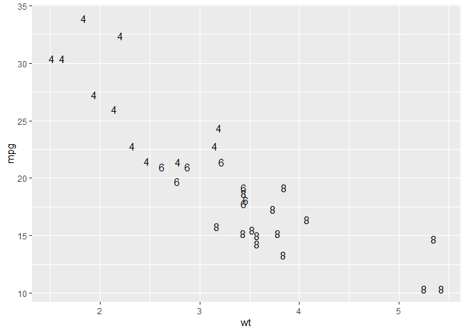
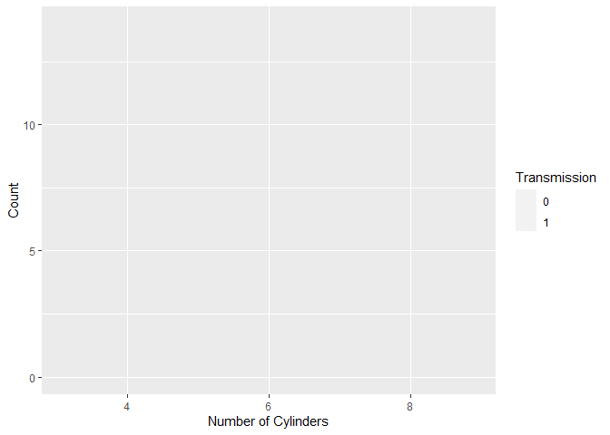
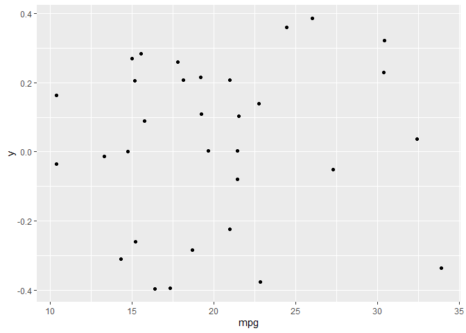
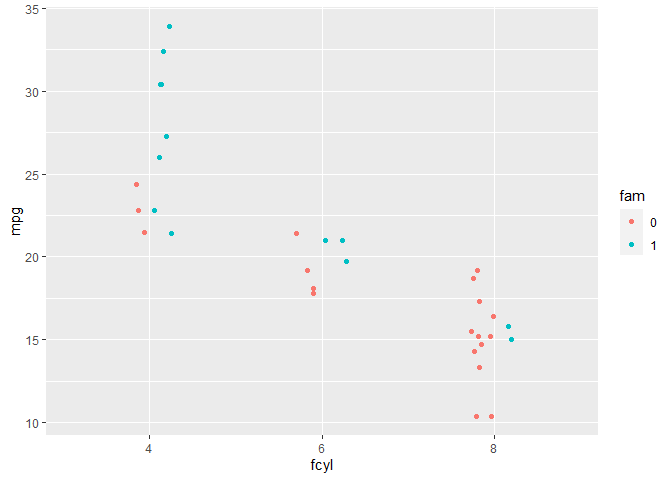

```r
# if we used both 'echo=TRUE' and 'results=hide' the pipe would not work properly
# if we used 'echo = FALSE' and 'results=hide' we would have only messages (i.e. attaching package) If we don't want them we set 'error = FALSE', 'warning = FALSE', and 'message = FALSE'.
library(dplyr)
```

```
## 
## Attaching package: 'dplyr'
```

```
## The following objects are masked from 'package:stats':
## 
##     filter, lag
```

```
## The following objects are masked from 'package:base':
## 
##     intersect, setdiff, setequal, union
```

```r
library(ggplot2)
library(gridExtra) # display plots side by side
```

```
## 
## Attaching package: 'gridExtra'
```

```
## The following object is masked from 'package:dplyr':
## 
##     combine
```

## Drawing your first plot


```r
# Load the ggplot2 package
library(ggplot2)

# Explore the mtcars data frame with str()
str(mtcars)
```

```
## 'data.frame':	32 obs. of  11 variables:
##  $ mpg : num  21 21 22.8 21.4 18.7 18.1 14.3 24.4 22.8 19.2 ...
##  $ cyl : num  6 6 4 6 8 6 8 4 4 6 ...
##  $ disp: num  160 160 108 258 360 ...
##  $ hp  : num  110 110 93 110 175 105 245 62 95 123 ...
##  $ drat: num  3.9 3.9 3.85 3.08 3.15 2.76 3.21 3.69 3.92 3.92 ...
##  $ wt  : num  2.62 2.88 2.32 3.21 3.44 ...
##  $ qsec: num  16.5 17 18.6 19.4 17 ...
##  $ vs  : num  0 0 1 1 0 1 0 1 1 1 ...
##  $ am  : num  1 1 1 0 0 0 0 0 0 0 ...
##  $ gear: num  4 4 4 3 3 3 3 4 4 4 ...
##  $ carb: num  4 4 1 1 2 1 4 2 2 4 ...
```

```r
# Execute the following command
ggplot(mtcars, aes(cyl, mpg)) +
  geom_point()
```

<!-- -->

## Data columns types affect plot types


```r
# Change the command below so that cyl is treated as factor
ggplot(mtcars, aes(factor(cyl), mpg)) +
  geom_point()
```

<!-- -->

## The grammar of graphics


```r
# Edit to add a color aesthetic mapped to disp
ggplot(mtcars, aes(wt, mpg, color = disp)) +
  geom_point()
```

<!-- -->

```r
# Change the color aesthetic to a size aesthetic
ggplot(mtcars, aes(wt, mpg, size = disp)) +
  geom_point()
```

<!-- -->

## ggplot2 layers


```r
load('diamonds.RData') # load R workspace

# Add geom_point() with +
ggplot(diamonds, aes(carat, price)) + geom_point()
```

<!-- -->

```r
# Add geom_smooth() with +
ggplot(diamonds, aes(carat, price)) +
  geom_point() + geom_smooth()
```

```
## `geom_smooth()` using method = 'gam' and formula 'y ~ s(x, bs = "cs")'
```

<!-- -->

## Changing one geom or every geom


```r
# Map the color aesthetic to clarity
ggplot(diamonds, aes(carat, price, color = clarity)) +
  geom_point() +
  geom_smooth()
```

```
## `geom_smooth()` using method = 'loess' and formula 'y ~ x'
```

<!-- -->

```r
# Make the points 40% opaque
ggplot(diamonds, aes(carat, price, color = clarity)) +
  geom_point(alpha = 0.4) +
  geom_smooth()
```

```
## `geom_smooth()` using method = 'loess' and formula 'y ~ x'
```

<!-- -->

## Saving plots as variables


```r
# Draw a ggplot
plt_price_vs_carat <- ggplot(diamonds, aes(carat, price)) + geom_point()
plt_price_vs_carat
```

<!-- -->

```r
# From previous step
plt_price_vs_carat <- ggplot(diamonds, aes(carat, price))

# Edit this to make points 20% opaque: plt_price_vs_carat_transparent
plt_price_vs_carat_transparent <- plt_price_vs_carat + geom_point(alpha = 0.2)

# See the plot
plt_price_vs_carat_transparent
```

<!-- -->

```r
# From previous step
plt_price_vs_carat <- ggplot(diamonds, aes(carat, price))

# Edit this to map color to clarity,
# Assign the updated plot to a new object
plt_price_vs_carat_by_clarity <- plt_price_vs_carat + geom_point(aes(color = clarity))

# See the plot
plt_price_vs_carat_by_clarity
```

<!-- -->

```r
# Which I believe gives the very same plot as the following line of code
tmp <- ggplot(diamonds, aes(carat, price, color = clarity)) + geom_point()

grid.arrange(plt_price_vs_carat_by_clarity, tmp, ncol = 2)
```

<!-- -->

## All about aesthetics: color, shape and size


```r
mtcars$fcyl <- factor(mtcars$cyl) # cyl transformed into a factor

# Map x to mpg and y to fcyl
ggplot(mtcars, aes(mpg, fcyl)) +
  geom_point()
```

<!-- -->

```r
# Swap mpg and fcyl
ggplot(mtcars, aes(fcyl, mpg)) +
  geom_point()
```

<!-- -->

```r
# Map x to wt, y to mpg and color to fcyl
ggplot(mtcars, aes(wt, mpg, color = fcyl)) +
  geom_point()
```

<!-- -->

```r
ggplot(mtcars, aes(wt, mpg, color = fcyl)) +
  # Set the shape and size of the points
  geom_point(shape = 1, size = 4)
```

<!-- -->

## All about aesthetics: color vs. fill


```r
mtcars$fam <- factor(mtcars$am) # am transformed into a factor

# Map fcyl to fill
ggplot(mtcars, aes(wt, mpg, fill = fcyl)) +
  geom_point(shape = 1, size = 4)
```

<!-- -->

```r
ggplot(mtcars, aes(wt, mpg, fill = fcyl)) +
  # Change point shape; set alpha
  geom_point(shape = 21, size = 4, alpha = 0.6)
```

<!-- -->

```r
# Map color to fam
ggplot(mtcars, aes(wt, mpg, fill = fcyl, color = fam)) +
  geom_point(shape = 21, size = 4, alpha = 0.6)
```

<!-- -->

Shapely coding! Notice that mapping a categorical variable onto fill doesn't change the colors, although a legend is generated! This is because the default shape for points only has a color attribute and not a fill attribute! Use fill when you have another shape (such as a bar), or when using a point that does have a fill and a color attribute, such as `shape = 21`, which is a circle with an outline. Any time you use a solid color, make sure to use alpha blending to account for over plotting.

## All about aesthetics: comparing aesthetics


```r
# Establish the base layer
plt_mpg_vs_wt <- ggplot(mtcars, aes(wt, mpg))

# Map fcyl to size
plt_mpg_vs_wt + geom_point(aes(size = fcyl))
```

```
## Warning: Using size for a discrete variable is not advised.
```

<!-- -->

```r
# Map fcyl to alpha, not size
plt_mpg_vs_wt +
  geom_point(aes(alpha = fcyl))
```

```
## Warning: Using alpha for a discrete variable is not advised.
```

<!-- -->

```r
# Map fcyl to shape, not alpha
plt_mpg_vs_wt +
  geom_point(aes(shape = fcyl))
```

<!-- -->

```r
# Use text layer and map fcyl to label
plt_mpg_vs_wt +
  geom_text(aes(label = fcyl))
```

<!-- -->

Note: `label` and `shape` are only applicable to categorical data.

## Using attributes

## All about attributes: color, shape, size and alpha


```r
# A hexadecimal color
my_blue <- "#4ABEFF"

ggplot(mtcars, aes(wt, mpg)) +
  # Set the point color and alpha
  geom_point(color = my_blue, alpha = 0.6)
```

<!-- -->

```r
# Change the color mapping to a fill mapping
ggplot(mtcars, aes(wt, mpg, fill = fcyl)) +
  # Set point size and shape
  geom_point(color = my_blue, size = 10, shape = 1)
```

<!-- -->

## All about attributes: conflicts with aesthetics


```r
ggplot(mtcars, aes(wt, mpg, color = fcyl)) +
  # Add point layer with alpha 0.5
  geom_point(alpha = 0.5)
```

<!-- -->

```r
ggplot(mtcars, aes(wt, mpg, color = fcyl)) +
  # Add text layer with label rownames(mtcars) and color red
  geom_text(label = row.names(mtcars), color = 'red')
```

<!-- -->

```r
ggplot(mtcars, aes(wt, mpg, color = fcyl)) +
  # Add points layer with shape 24 and color yellow
geom_point(shape = 24, color = "yellow")
```

<!-- -->

## Going all out

Notice that adding more aesthetic mappings to your plot is not always a good idea! You may just increase complexity and decrease readability.


```r
# 3 aesthetics: qsec vs. mpg, colored by fcyl
ggplot(mtcars, aes(mpg, qsec, color = fcyl)) +
  geom_point()
```

<!-- -->

```r
# 4 aesthetics: add a mapping of shape to fam
ggplot(mtcars, aes(mpg, qsec, color = fcyl, shape = fam)) +
  geom_point()
```

<!-- -->

```r
# 5 aesthetics: add a mapping of size to hp / wt
ggplot(mtcars, aes(mpg, qsec, color = fcyl, shape = fam, size = hp/wt)) +
  geom_point()
```

<!-- -->

That's a pretty slick plot! Between the x and y dimensions, the color, shape, and size of the points, your plot displays five dimensions of the dataset!

## Modifying aesthetics

## Updating aesthetic labels


```r
ggplot(mtcars, aes(fcyl, fill = fam)) +
  geom_bar() +
  # Set the axis labels
  labs(x = "Number of Cylinders",
  y = "Count")
```

<!-- -->

```r
palette <- c(automatic = "#377EB8", manual = "#E41A1C")

ggplot(mtcars, aes(fcyl, fill = fam)) +
  geom_bar() +
  labs(x = "Number of Cylinders", y = "Count") +
  # Set the fill color scale
  scale_fill_manual("Transmission", values = palette)
```

<!-- -->

```r
palette <- c(automatic = "#377EB8", manual = "#E41A1C")

# Set the position
ggplot(mtcars, aes(fcyl, fill = fam)) +
  geom_bar(position = 'dodge') +
  labs(x = "Number of Cylinders", y = "Count")
```

<!-- -->

```r
  scale_fill_manual("Transmission", values = palette)
```

```
## <ggproto object: Class ScaleDiscrete, Scale, gg>
##     aesthetics: fill
##     axis_order: function
##     break_info: function
##     break_positions: function
##     breaks: waiver
##     call: call
##     clone: function
##     dimension: function
##     drop: TRUE
##     expand: waiver
##     get_breaks: function
##     get_breaks_minor: function
##     get_labels: function
##     get_limits: function
##     guide: legend
##     is_discrete: function
##     is_empty: function
##     labels: waiver
##     limits: NULL
##     make_sec_title: function
##     make_title: function
##     map: function
##     map_df: function
##     n.breaks.cache: NULL
##     na.translate: TRUE
##     na.value: NA
##     name: Transmission
##     palette: function
##     palette.cache: NULL
##     position: left
##     range: <ggproto object: Class RangeDiscrete, Range, gg>
##         range: NULL
##         reset: function
##         train: function
##         super:  <ggproto object: Class RangeDiscrete, Range, gg>
##     rescale: function
##     reset: function
##     scale_name: manual
##     train: function
##     train_df: function
##     transform: function
##     transform_df: function
##     super:  <ggproto object: Class ScaleDiscrete, Scale, gg>
```

## Setting a dummy aesthetic

We need it when we want univariate plots.

```r
# Plot 0 vs. mpg
ggplot(mtcars, aes(mpg, 0)) +
  # Add jitter 
  geom_point(position = "jitter")
```

<!-- -->

```r
ggplot(mtcars, aes(mpg, 0)) +
  geom_jitter() +
  # Set the y-axis limits
  ylim(c(-2, 2))
```

<!-- -->

## Scatter plots

## Overplotting 1: large datasets


```r
load("diamonds.RData")

# Plot price vs. carat, colored by clarity
plt_price_vs_carat_by_clarity <- ggplot(diamonds, aes(carat, price, color = clarity))

# Add a point layer with tiny points
plt_price_vs_carat_by_clarity + geom_point(alpha = 0.5, shape = ".")
```

<!-- -->

```r
# Update the point shape to remove the line outlines by setting shape to 16
plt_price_vs_carat_by_clarity + geom_point(alpha = 0.5, shape = 16)
```

<!-- -->

## Overplotting 2: Aligned values


```r
# Plot base
plt_mpg_vs_fcyl_by_fam <- ggplot(mtcars, aes(fcyl, mpg, color = fam))

# Default points are shown for comparison
plt_mpg_vs_fcyl_by_fam + geom_point()
```

<!-- -->

```r
# Alter the point positions by jittering, width 0.3
plt_mpg_vs_fcyl_by_fam + geom_point(position = position_jitter(width = 0.3))
```

<!-- -->

```r
# Now jitter and dodge the point positions
plt_mpg_vs_fcyl_by_fam + geom_point(position = position_jitterdodge(jitter.width = 0.3, dodge.width = 0.3))
```

<!-- -->


