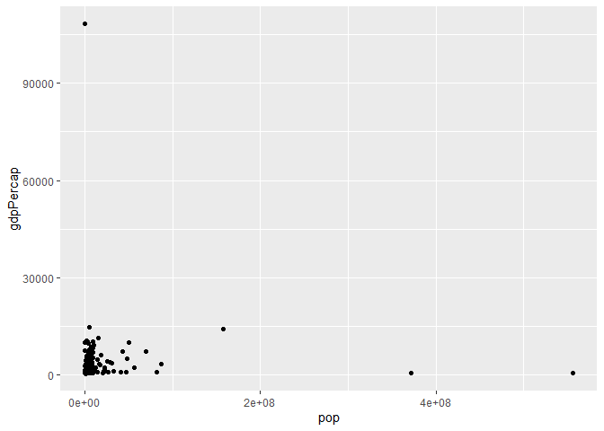
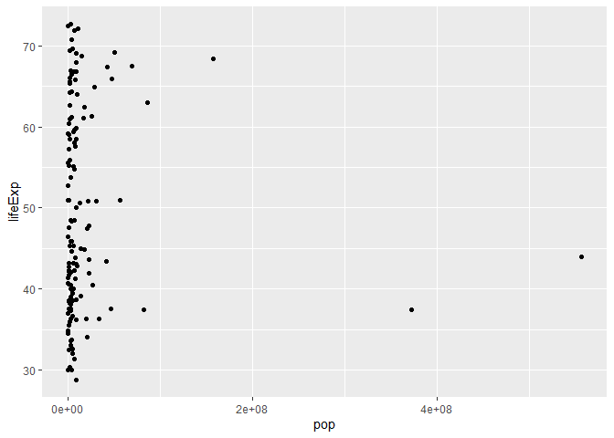
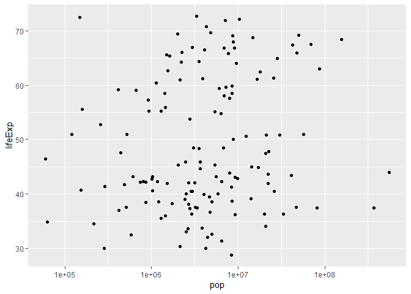
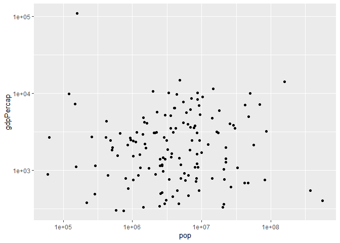

```r
# if we used both 'echo=True' and 'results=hide' the pipe would not work properly
library(gapminder)
library(dplyr)
```

```
## 
## Attaching package: 'dplyr'
```

```
## The following objects are masked from 'package:stats':
## 
##     filter, lag
```

```
## The following objects are masked from 'package:base':
## 
##     intersect, setdiff, setequal, union
```

## Filter verbe


```r
# Filter the gapminder dataset for the year 1957
gapminder %>% filter(year == "1957")
```

```
## # A tibble: 142 x 6
##    country     continent  year lifeExp      pop gdpPercap
##    <fct>       <fct>     <int>   <dbl>    <int>     <dbl>
##  1 Afghanistan Asia       1957    30.3  9240934      821.
##  2 Albania     Europe     1957    59.3  1476505     1942.
##  3 Algeria     Africa     1957    45.7 10270856     3014.
##  4 Angola      Africa     1957    32.0  4561361     3828.
##  5 Argentina   Americas   1957    64.4 19610538     6857.
##  6 Australia   Oceania    1957    70.3  9712569    10950.
##  7 Austria     Europe     1957    67.5  6965860     8843.
##  8 Bahrain     Asia       1957    53.8   138655    11636.
##  9 Bangladesh  Asia       1957    39.3 51365468      662.
## 10 Belgium     Europe     1957    69.2  8989111     9715.
## # ... with 132 more rows
```

```r
gapminder %>% filter(country == "China", year == '2002')
```

```
## # A tibble: 1 x 6
##   country continent  year lifeExp        pop gdpPercap
##   <fct>   <fct>     <int>   <dbl>      <int>     <dbl>
## 1 China   Asia       2002    72.0 1280400000     3119.
```

## Arrange verbe


```r
# Arranging observations by life expectancy

# Sort in ascending order of lifeExp
gapminder %>% arrange(lifeExp)
```

```
## # A tibble: 1,704 x 6
##    country      continent  year lifeExp     pop gdpPercap
##    <fct>        <fct>     <int>   <dbl>   <int>     <dbl>
##  1 Rwanda       Africa     1992    23.6 7290203      737.
##  2 Afghanistan  Asia       1952    28.8 8425333      779.
##  3 Gambia       Africa     1952    30    284320      485.
##  4 Angola       Africa     1952    30.0 4232095     3521.
##  5 Sierra Leone Africa     1952    30.3 2143249      880.
##  6 Afghanistan  Asia       1957    30.3 9240934      821.
##  7 Cambodia     Asia       1977    31.2 6978607      525.
##  8 Mozambique   Africa     1952    31.3 6446316      469.
##  9 Sierra Leone Africa     1957    31.6 2295678     1004.
## 10 Burkina Faso Africa     1952    32.0 4469979      543.
## # ... with 1,694 more rows
```

```r
# Sort in descending order of lifeExp
gapminder %>% arrange(desc(lifeExp))
```

```
## # A tibble: 1,704 x 6
##    country          continent  year lifeExp       pop gdpPercap
##    <fct>            <fct>     <int>   <dbl>     <int>     <dbl>
##  1 Japan            Asia       2007    82.6 127467972    31656.
##  2 Hong Kong, China Asia       2007    82.2   6980412    39725.
##  3 Japan            Asia       2002    82   127065841    28605.
##  4 Iceland          Europe     2007    81.8    301931    36181.
##  5 Switzerland      Europe     2007    81.7   7554661    37506.
##  6 Hong Kong, China Asia       2002    81.5   6762476    30209.
##  7 Australia        Oceania    2007    81.2  20434176    34435.
##  8 Spain            Europe     2007    80.9  40448191    28821.
##  9 Sweden           Europe     2007    80.9   9031088    33860.
## 10 Israel           Asia       2007    80.7   6426679    25523.
## # ... with 1,694 more rows
```

```r
# Filter for the year 1957, then arrange in descending order of population
gapminder %>% filter(year == "1957") %>% arrange(desc(pop))
```

```
## # A tibble: 142 x 6
##    country        continent  year lifeExp       pop gdpPercap
##    <fct>          <fct>     <int>   <dbl>     <int>     <dbl>
##  1 China          Asia       1957    50.5 637408000      576.
##  2 India          Asia       1957    40.2 409000000      590.
##  3 United States  Americas   1957    69.5 171984000    14847.
##  4 Japan          Asia       1957    65.5  91563009     4318.
##  5 Indonesia      Asia       1957    39.9  90124000      859.
##  6 Germany        Europe     1957    69.1  71019069    10188.
##  7 Brazil         Americas   1957    53.3  65551171     2487.
##  8 United Kingdom Europe     1957    70.4  51430000    11283.
##  9 Bangladesh     Asia       1957    39.3  51365468      662.
## 10 Italy          Europe     1957    67.8  49182000     6249.
## # ... with 132 more rows
```

## The mutate verbe


```r
# Using mutate to change or create a column

# Use mutate to change lifeExp to be in months
gapminder %>% mutate(lifeExp = lifeExp * 12)
```

```
## # A tibble: 1,704 x 6
##    country     continent  year lifeExp      pop gdpPercap
##    <fct>       <fct>     <int>   <dbl>    <int>     <dbl>
##  1 Afghanistan Asia       1952    346.  8425333      779.
##  2 Afghanistan Asia       1957    364.  9240934      821.
##  3 Afghanistan Asia       1962    384. 10267083      853.
##  4 Afghanistan Asia       1967    408. 11537966      836.
##  5 Afghanistan Asia       1972    433. 13079460      740.
##  6 Afghanistan Asia       1977    461. 14880372      786.
##  7 Afghanistan Asia       1982    478. 12881816      978.
##  8 Afghanistan Asia       1987    490. 13867957      852.
##  9 Afghanistan Asia       1992    500. 16317921      649.
## 10 Afghanistan Asia       1997    501. 22227415      635.
## # ... with 1,694 more rows
```

```r
# Use mutate to create a new column called lifeExpMonths
gapminder %>% mutate(lifeExpMonths = 12 * lifeExp)
```

```
## # A tibble: 1,704 x 7
##    country     continent  year lifeExp      pop gdpPercap lifeExpMonths
##    <fct>       <fct>     <int>   <dbl>    <int>     <dbl>         <dbl>
##  1 Afghanistan Asia       1952    28.8  8425333      779.          346.
##  2 Afghanistan Asia       1957    30.3  9240934      821.          364.
##  3 Afghanistan Asia       1962    32.0 10267083      853.          384.
##  4 Afghanistan Asia       1967    34.0 11537966      836.          408.
##  5 Afghanistan Asia       1972    36.1 13079460      740.          433.
##  6 Afghanistan Asia       1977    38.4 14880372      786.          461.
##  7 Afghanistan Asia       1982    39.9 12881816      978.          478.
##  8 Afghanistan Asia       1987    40.8 13867957      852.          490.
##  9 Afghanistan Asia       1992    41.7 16317921      649.          500.
## 10 Afghanistan Asia       1997    41.8 22227415      635.          501.
## # ... with 1,694 more rows
```

```r
# Combining filter, mutate, and arrange
# Filter, mutate, and arrange the gapminder dataset
gapminder %>% filter(year == "2007") %>% mutate(lifeExpMonths = 12 * lifeExp) %>% arrange(desc(lifeExpMonths))
```

```
## # A tibble: 142 x 7
##    country          continent  year lifeExp       pop gdpPercap lifeExpMonths
##    <fct>            <fct>     <int>   <dbl>     <int>     <dbl>         <dbl>
##  1 Japan            Asia       2007    82.6 127467972    31656.          991.
##  2 Hong Kong, China Asia       2007    82.2   6980412    39725.          986.
##  3 Iceland          Europe     2007    81.8    301931    36181.          981.
##  4 Switzerland      Europe     2007    81.7   7554661    37506.          980.
##  5 Australia        Oceania    2007    81.2  20434176    34435.          975.
##  6 Spain            Europe     2007    80.9  40448191    28821.          971.
##  7 Sweden           Europe     2007    80.9   9031088    33860.          971.
##  8 Israel           Asia       2007    80.7   6426679    25523.          969.
##  9 France           Europe     2007    80.7  61083916    30470.          968.
## 10 Canada           Americas   2007    80.7  33390141    36319.          968.
## # ... with 132 more rows
```

## ggplot2


```r
library(ggplot2)
```


```r
gapminder_1952 <- gapminder %>%
  filter(year == 1952)

# Change to put pop on the x-axis and gdpPercap on the y-axis
ggplot(gapminder_1952, aes(x = pop, y = gdpPercap)) +
  geom_point()
```

<!-- -->

```r
# Create a scatter plot with pop on the x-axis and lifeExp on the y-axis
ggplot(gapminder_1952, aes(x = pop, y = lifeExp)) + geom_point()
```

<!-- -->

```r
# log scale

# Change this plot to put the x-axis on a log scale
ggplot(gapminder_1952, aes(x = pop, y = lifeExp)) +
  geom_point() + scale_x_log10()
```

<!-- -->

```r
# # Scatter plot comparing pop and gdpPercap, with both axes on a log scale
ggplot(gapminder_1952, aes(x = pop, y = gdpPercap)) + geom_point() + scale_x_log10() + scale_y_log10()
```

<!-- -->


